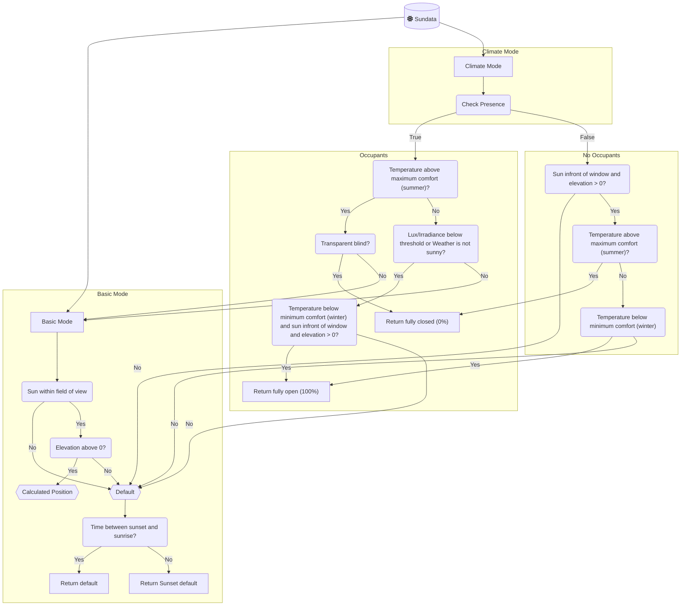
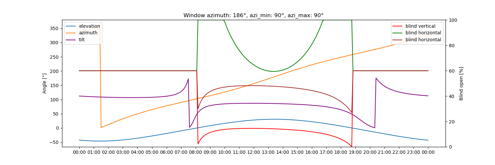

[](LICENSE)


# Adaptive Cover (MRV Fork)

> **Fork notice:** This is a fork of [basbruss/adaptive-cover](https://github.com/basbruss/adaptive-cover) with additional features. Changes include "Next State Change" and "Last State Change Reason" sensors. To install via HACS, add `https://github.com/mrvollger/adaptive-cover` as a custom repository.

This Custom-Integration provides sensors for vertical and horizontal blinds based on the sun's position by calculating the position to filter out direct sunlight.

This integration builds upon the template sensor from this forum post [Automatic Blinds](https://community.home-assistant.io/t/automatic-blinds-sunscreen-control-based-on-sun-platform/)

- [Adaptive Cover](#adaptive-cover)
  - [Features](#features)
  - [Installation](#installation)
    - [HACS (Recommended)](#hacs-recommended)
    - [Manual](#manual)
  - [Setup](#setup)
  - [Cover Types](#cover-types)
  - [Modes](#modes)
    - [Basic mode](#basic-mode)
    - [Climate mode](#climate-mode)
      - [Climate strategies](#climate-strategies)
  - [Variables](#variables)
    - [Common](#common)
    - [Vertical](#vertical)
    - [Horizontal](#horizontal)
    - [Tilt](#tilt)
    - [Automation](#automation)
    - [Climate](#climate)
    - [Blindspot](#blindspot)
  - [Entities](#entities)
  - [Features Planned](#features-planned)
    - [Simulation](#simulation)
    - [Blueprint (deprecated since v1.0.0)](#blueprint-deprecated-since-v100)
  - [License](#license)

## New in v1.14–v1.19: the house redesign (this fork)

**One screen for the whole house.** Add a dashboard with the bundled strategy and you get every window grouped by floor and room, with Auto / Hold / Off for the house, each room and each window, Open all / Close all, Return all to auto, and a detail sheet per window ("why this position", next move, hold chips):

```yaml
# Settings → Dashboards → Add dashboard → New dashboard from scratch → ⋮ → Raw configuration editor
strategy:
  type: custom:adaptive-cover
views: []
```

Or drop `type: custom:adaptive-cover-house-card` into any dashboard (options: `floors`, `areas`, `title`). The card finds windows by themselves; rooms and floors come from Home Assistant's areas and floors, so give each window's device (or its cover) an area.

**Auto / Hold / Off per window** (`select.<window>_mode`):

- **Auto** — follows the sun (and climate, if on).
- **Hold** — keeps the shade where it is until the hold ends; moving a shade by hand puts it on Hold for the override duration (2 h by default). Holds survive a Home Assistant restart.
- **Off** — no moves and no manual-move detection.

Hold a room from an automation — one call, any window, room or floor:

```yaml
action: adaptive_cover.hold
target:
  area_id: office
data:
  duration: "04:00:00"   # optional; default = the override duration
  position: 0            # optional; move there first, then hold
```

`select.select_option` (auto / hold / off) and the Return-to-auto buttons also accept area and floor targets. The house device ("All shades") has a Mode select that sets every window at once and shows Mixed when windows differ.

**Setup is one screen.** Adding a window asks for its cover (the only required field), then direction and size; everything else has sensible defaults in collapsed sections. Pick a preset (window, window under an overhang, glass door) or copy another window's settings. Each window has exactly one cover. A window's **Reconfigure** changes its cover, type and geometry; its **Configure** changes everything else.

**Names are consistent**: `<window> Position`, `<window> Mode`, `<window> Return to auto`, … (entity ids like `sensor.office_door_position`). Diagnostic sensors (sun in front, control method, next/last change) are grouped under the device's Diagnostic section.

**Coming next (v1.20+)**: house, floor and room settings — set a threshold, the override duration or a schedule once for the house and let a room differ only where it needs to — are already computed and shown in each Position sensor's `provenance` attribute; they become editable from the card and the house device in v1.20.

## New in v1.1.0 (this fork)

**Physical model of your window, not just the sun:**

- **Overhang modeling** — configure the depth and height of a balcony/eave above the window (vertical covers). The integration computes the shadow line via the solar profile angle: when architecture already shades the glass, the shade stays open instead of pointlessly tracking. Replaces per-entry `max_elevation` hacks.
- **Glare-band mode** — configure eye height and the distance to the nearest seat. On cold sunny days the shade opens exactly as far as eye comfort allows: warmth on the floor, no beam in your eyes (instead of the old all-or-nothing winter behavior).
- **Privacy after dusk** — close automatically N minutes after sunset until sunrise, overriding all solar/climate logic. No more DIY automations fighting the manual-override detector.
- **Movement smoothing** — quiet hours (no tracking moves at night) and a max-moves-per-hour budget stop the "3% at a time" motor noise; transitions to fully open/closed/default always pass.

**Explainability:**

- The Cover Position sensor now exposes `intent` (what the integration is trying to do), `decision_trace` (every rule it evaluated), and `forecast_today` (the planned schedule as change-points).
- `adaptive_cover.get_forecast` service returns today's schedule for any config entry.

Plot the plan with [ApexCharts card](https://github.com/RomRider/apexcharts-card):

```yaml
type: custom:apexcharts-card
header: { show: true, title: Shade plan today }
graph_span: 24h
span: { start: day }
series:
  - entity: sensor.vertical_cover_position_your_name
    data_generator: |
      return entity.attributes.forecast_today.map(e =>
        [new Date(e.time).getTime(), e.position]);
    curve: stepline
```

**Engineering:** all math/strategy logic now lives in a pure engine (`custom_components/adaptive_cover/engine/`) with no HA imports or clock reads, validated by a 216-row climate truth table, 11 committed golden-day schedules, ~1,500 tests, and regression tests for every historical bug fix.


## Features

- Individual service devices for `vertical`, `horizontal` and `tilted` covers
- Two mode approach with multiple strategies [Modes(`basic`,`climate`)](https://github.com/mrvollger/adaptive-cover?tab=readme-ov-file#modes)
- Binary Sensor to track when the sun is in front of the window
- Sensors for `start` and `end` time
- Auto manual override detection

- **Climate Mode**

  - Weather condition based operation
  - Presence based operation
  - One Climate switch for the house (rooms can turn it off; a window can ignore climate control)
  - Sensor for displaying the operation modus (`winter`,`intermediate`,`summer`)

- **Adaptive Control**

  - Turn control on/off
  - One window per cover; group control through Home Assistant areas and floors
  - Set start time to prevent opening blinds while you are asleep
  - Set minimum interval time between position changes
  - set minimum percentage change

## Installation

### HACS (Recommended)

Add <https://github.com/mrvollger/adaptive-cover> as custom repository to HACS.
Search and download Adaptive Cover within HACS.

Restart Home-Assistant and add the integration.

### Manual

Download the `adaptive_cover` folder from this github.
Add the folder to `config/custom_components/`.

Restart Home-Assistant and add the integration.

### Updating to 2.1

Since 2.1 every window is part of one house entry. Take a backup, then
update from 1.19.x (or 2.0.x) straight to 2.1 and restart once: at its
first start 2.1 moves every window entry into the house, checks that
every entity, device, setting and Mode came through unchanged, then
removes the old entries. A notification says what was done; the log has
each step, and `.storage/adaptive_cover.v1_snapshot` keeps a copy of what
was there.

If a check fails, 2.1 removes nothing, puts every window back as 1.19.x
left it and shows the "The Adaptive Cover upgrade stopped" repair with
the reason; install 1.19.x again (or restore the backup) to run the house
as before. To go back from 2.1 after the upgrade, restore the backup.

## Setup

Adaptive Cover supports (for now) three types of covers/blinds; `Vertical` and `Horizontal` and `Venetian (Tilted)` blinds.
Each type has its own specific parameters to setup a sensor. To setup the sensor you first need to find out the azimuth of the window(s). This can be done by finding your location on [Open Street Map Compass](https://osmcompass.com/).

## Cover Types

|              | Vertical                      | Horizontal                      | Tilted                          |
| ------------ | ----------------------------- | ------------------------------- | ------------------------------- |
|              |  |  |  |
| **Movement** | Up/Down                       | In/Out                          | Tilting                         |
|              | [variables](#vertical)        | [variables](#horizontal)        | [variables](#tilt)              |

## Modes

This component supports two strategy modes: A `basic` mode and a `climate comfort/energy saving` mode that works with presence and temperature detection.



### Basic mode

This mode uses the calculated position when the sun is within the specified azimuth range of the window. Else it defaults to the default value or after sunset value depending on the time of day.

### Climate mode

This mode calculates the position based on extra parameters for presence, indoor temperature, minimal comfort temperature, maximum comfort temperature and weather (optional).
A window uses it while the house's Climate switch is on (a room can turn it off), when it has a temperature source (an indoor temperature sensor from its window, room, floor or house, an outside temperature sensor or a weather entity) and when **Ignore climate control** (Change window, Advanced) is off.
This mode is split up in two types of strategies; [Presence](https://github.com/mrvollger/adaptive-cover?tab=readme-ov-file#presence) and [No Presence](https://github.com/mrvollger/adaptive-cover?tab=readme-ov-file#no-presence).

#### Climate strategies

- **No Presence**:
  Providing daylight to the room is no objective if there is no presence.

  - **Below minimal comfort temperature**:
    If the sun is above the horizon and the indoor temperature is below the minimal comfort temperature it opens the blind fully or tilt the slats to be parallel with the sun rays to allow for maximum solar radiation to heat up the room.

  - **Above maximum comfort temperature**:
    The objective is to not heat up the room any further by blocking out all possible radiation. All blinds close fully to block out light. <br> <br>
    If the indoor temperature is between both thresholds the position defaults to the set default value based on the time of day.

- **Presence** (or no Presence Entity set):
  The objective is to reduce glare while providing daylight to the room. All calculation is done by the basic model for Horizontal and Vertical blinds. <br> <br>
  If you added a weather entity, it will only use the above calculations if the weather state corresponds with the existence of direct sun rays. These states are `sunny`, `partlycloudy`, `clear`, `windy`, and `windy-variant` by default, but you can change the list of states in the weather options. If not equal to these states the position will default to the default value to allow more sunlight entering the room with minimizing the glare due to the weather condition. <br><br>
  Tilted blinds will only deviate from the above approach if the inside temperature is above the maximum comfort temperature. In that case, the slats will be positioned at 45 degrees as this is [found optimal](https://www.mdpi.com/1996-1073/13/7/1731).

## Variables

### Common

| Variables                     | Default | Range | Description                                                                                              |
| ----------------------------- | ------- | ----- | -------------------------------------------------------------------------------------------------------- |
| Cover                         |         |       | The one cover this window drives. A cover belongs to one window; add one window per cover                |
| Window Azimuth                | 180     | 0-359 | The compass direction of the window, discoverable via [Open Street Map Compass](https://osmcompass.com/) |
| Default Position              | 100     | 0-100 | Initial position of the cover in the absence of sunlight glare detection                                 |
| Minimal Position              | 100     | 0-99  | Minimal opening position for the cover, suitable for partially closing certain cover types               |
| Maximum Position              | 100     | 1-100 | Maximum opening position for the cover, suitable for partially opening certain cover types               |
| Field of view Left            | 90      | 1-90  | Unobstructed viewing angle from window center to the left, in degrees                                    |
| Field of view Right           | 90      | 1-90  | Unobstructed viewing angle from window center to the right, in degrees                                   |
| Minimal Elevation             | None    | 0-90  | Minimal elevation degree of the sun to be considered                                                     |
| Maximum Elevation             | None    | 1-90  | Maximum elevation degree of the sun to be considered                                                     |
| Default position after Sunset | 0       | 0-100 | Cover's default position from sunset to sunrise                                                          |
| Offset Sunset time            | 0       |       | Additional minutes before/after sunset                                                                   |
| Offset Sunrise time           | 0       |       | Additional minutes before/after sunrise                                                                  |
| Inverse State                 | False   |       | Calculates inverse state for covers fully closed at 100%                                                 |

### Vertical

| Variables         | Default | Range | Description                                                                                 |
| ----------------- | ------- | ----- | ------------------------------------------------------------------------------------------- |
| Window Height     | 2.1     | 0.1-6 | Length of fully extended cover/window                                                       |
| Glare Zone        | 0.5     | 0.1-2 | Objects within this distance of the cover recieve direct sunlight. Measured horizontally from the bottom of the cover when fully extended |

### Horizontal

| Variables                  | Default | Range | Description                                    |
| -------------------------- | ------- | ----- | ---------------------------------------------- |
| Awning Height              | 2       | 0.1-6 | Height from work area to awning mounting point |
| Awning Length (horizontal) | 2.1     | 0.3-6 | Length of the awning when fully extended       |
| Awning Angle               | 0       | 0-45  | Angle of the awning from the wall              |
| Glare Zone                 | 0.5     | 0.1-2 | Objects within this distance of the cover recieve direct sunlight |

### Tilt

| Variables     | Default        | Range  | Description                                                |
| ------------- | -------------- | ------ | ---------------------------------------------------------- |
| Slat Depth    | 3              | 0.1-15 | Width of each slat                                         |
| Slat Distance | 2              | 0.1-15 | Vertical distance between two slats in horizontal position |
| Tilt Mode     | Bi-directional |        |                                                            |

### Automation

| Variables                                  | Default      | Range | Description                                                                                    |
| ------------------------------------------ | ------------ | ----- | ---------------------------------------------------------------------------------------------- |
| Minimum Delta Position                     | 1            | 1-90  | Minimum position change required before another change can occur                               |
| Minimum Delta Time                         | 2            |       | Minimum time gap between position change                                                       |
| Start Time                                 | `"00:00:00"` |       | Earliest time a cover can be adjusted after midnight                                           |
| Start Time Entity                          | None         |       | The earliest moment a cover may be changed after midnight. _Overrides the `start_time` value_  |
| Manual Override Duration                   | `2 h`        |       | Minimum duration for manual control status to remain active                                    |
| Manual Override reset Timer                | False        |       | Resets duration timer each time the position changes while the manual control status is active |
| Manual Override Threshold                  | None         | 1-99  | Minimal position change to be recognized as manual change                                      |
| Manual Override ignore intermediate states | False        |       | Ignore StateChangedEvents that have state `opening` or `closing`                               |
| End Time                                   | `"00:00:00"` |       | Latest time a cover can be adjusted each day                                                   |
| End Time Entity                            | None         |       | The latest moment a cover may be changed . _Overrides the `end_time` value_                    |
| Adjust at end time                         | `False`      |       | Make sure to always update the position to the default setting at the end time.                |

### Climate

| Variables                     | Default | Range | Example                                       | Description                                                                                                                                          |
| ----------------------------- | ------- | ----- | --------------------------------------------- | ---------------------------------------------------------------------------------------------------------------------------------------------------- |
| Indoor Temperature Entity     | `None`  |       | `climate.living_room` \| `sensor.indoor_temp` |                                                                                                                                                      |
| Minimum Comfort Temperature   | 22 °C / 72 °F | 0-86  |                                         | The default follows Home Assistant's unit system.                                                                                                    |
| Maximum Comfort Temperature   | 24 °C / 75 °F | 0-86  |                                         | The default follows Home Assistant's unit system.                                                                                                    |
| Threshold Hysteresis          | `0` (off) | 0-3 °C / 0-5 °F |                                  | How far past a threshold the temperature must go before the season changes back. Stops the shades switching back and forth while the temperature hovers at a threshold. A house setting (a room can override it). Not kept across restarts: the first decision after one uses the plain thresholds. |
| Outdoor Temperature Entity    | `None`  |       | `sensor.outdoor_temp`                         |                                                                                                                                                      |
| Outdoor Temperature Threshold | `None`  |       |                                               | If the minimum outside temperature for summer mode is set and the outside temperature falls below this threshold, summer mode will not be activated. |
| Presence Entity               | `None`  |       |                                               |                                                                                                                                                      |
| Weather Entity                | `None`  |       | `weather.home`                                | Can also serve as outdoor temperature sensor                                                                                                         |
| Lux Entity                    | `None`  |       | `sensor.lux`                                  | Returns measured lux                                                                                                                                 |
| Lux Threshold                 | `1000`  |       |                                               | "In non-summer, above threshold, use optimal position. Otherwise, default position or fully open in winter."                                         |
| Irradiance Entity             | `None`  |       | `sensor.irradiance`                           | Returns measured irradiance                                                                                                                          |
| Irradiance Threshold          | `300`   |       |                                               | "In non-summer, above threshold, use optimal position. Otherwise, default position or fully open in winter."                                         |
| Ignore climate control        | `False` |       |                                               | A window setting (Change window, Advanced): the window follows the sun only, whatever the house's Climate switch says.                              |

### Blindspot

| Variables            | Default | Range                 | Example | Description                                                                                                          |
| -------------------- | ------- | --------------------- | ------- | -------------------------------------------------------------------------------------------------------------------- |
| Blind Spot Left      | None    | 0-max(fov_right, 180) |         | Start point of the blind spot on the predefined field of view, where 0 is equal to the window azimuth - fov left.    |
| Blind Spot Right     | None    | 1-max(fov_right, 180) |         | End point of the blind spot on the predefined field of view, where 1 is equal to the window azimuth - fov left + 1 . |
| Blind Spot Elevation | None    | 0-90                  |         | Minimal elevation of the sun for the blindspot area.                                                                 |

## Entities

The integration dynamically adds multiple entities based on the used features.

These entities are always available:
| Entities | Default | Description |
| --------------------------------------------- | -------------- | ---------------------------------------------------------------------------------------------------------------------- |
| `sensor.{type}_cover_position_{name}` | | Reflects the current state determined by predefined settings and factors such as sun position, weather, and temperature |
| `sensor.{type}_control_method_{name}` | `intermediate` | Indicates the active control strategy based on weather conditions. Options include `winter`, `summer`, and `intermediate` |
| `sensor.{type}_start_sun_{name}` | | Shows the starting time when the sun enters the window's view, with an interval of every 5 minutes. |
| `sensor.{type}_end_sun_{name}` | | Indicates the ending time when the sun exits the window's view, with an interval of every 5 minutes. |
| `sensor.{type}_next_state_change_{name}` | | Predicts the next cover position change: event, time, and expected position |
| `sensor.{type}_last_state_change_{name}` | | Records the most recent position change with old/new positions and reason |
| `binary_sensor.{type}_manual_override_{name}` | `off` | Indicates if manual override is engaged for any blinds. |
| `binary_sensor.{type}_sun_infront_{name}` | `off` | Indicates whether the sun is in front of the window within the designated field of view. |
| `select.{name}_mode` | `auto` | The window's Mode: `auto` follows the sun (and climate), `hold` keeps a manual position until it expires, `off` stops moves and manual-move detection. |
| `button.{name}_return_to_auto` | | Ends a hold (or turns an `off` window on) and moves the covers back to the adaptive position. |

The house device ("All shades") has the controls for every window: the
aggregate cover, the house Mode, Return all to auto, and the house
settings (the Climate switch, manual-move detection, the outside
temperature / lux / irradiance switches, the thresholds, durations and
times). Since v2.1 windows have no switches of their own.


## Features Planned

- Manual override controls

  - ~~Time to revert back to adaptive control~~
  - ~~Reset button~~
  - Wait until next manual/none adaptive change

- ~~Algorithm to control radiation and/or illumination~~

### Simulation



One simulated day: the sun angles (left axis) and the computed cover positions (right axis). An early version of the algorithm made this plot, so it shows the idea, not the exact output of the current release.

### Blueprint (deprecated since v1.0.0)

This integration provides the option to download a blueprint to control the covers automatically by the provide sensor.
By selecting the option the blueprints will be added to your local blueprints folder.

## License

Adaptive Cover is released under the [MIT License](LICENSE). The Lovelace card bundle (source in [`card/`](card/), shipped as `custom_components/adaptive_cover/www/adaptive-cover-card.js`) is also MIT-licensed; its [own license file](card/LICENSE) keeps the upstream card's copyright notice. Contributions are accepted under the same license (see [CONTRIBUTING.md](CONTRIBUTING.md)).
